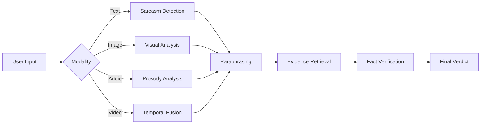

# FactCheck-MM Demo

A lightweight, self-contained demonstration of the FactCheck-MM multimodal fact-checking pipeline.

## 🎯 What This Demo Does

This demo showcases the complete FactCheck-MM pipeline:
1. **Input Processing** - Accept text, images, audio, or video  
2. **Sarcasm Detection** - Detect if content is sarcastic across modalities  
3. **Paraphrasing** - Convert sarcastic/ambiguous text to literal claims  
4. **Fact Verification** - Check claims against knowledge bases (SUPPORTS/REFUTES/NOT_ENOUGH_INFO)

## 🚀 Quick Start

### Prerequisites
- Python 3.10+  
- ~50 MB disk space

### Installation
```bash
# Navigate to demo folder
cd demo/

# Install dependencies
pip install -r requirements-demo.txt


### Running the Demo

**Option 1: Streamlit (Recommended)**
streamlit run app.py

The app will open at `http://localhost:8501`

**Option 2: Command Line Test**
python mock_pipeline.py


## 📁 Demo Contents

demo/
├── app.py # Streamlit UI application
├── mock_pipeline.py # Mock ML functions (fallback when models unavailable)
├── demo_inputs.json # Pre-configured test inputs
├── requirements-demo.txt # Minimal dependencies
├── assets/ # Sample media files
│ ├── pm_inaug.jpg # Sample image for text+image demo
│ ├── infographic_vaccine.jpg # Sample infographic
# FactCheck-MM Demo

A lightweight, self-contained demonstration of the FactCheck-MM multimodal fact-checking pipeline.

## 🎯 What This Demo Does

This demo showcases the complete FactCheck-MM pipeline:
1. **Input Processing** - Accept text, images, audio, or video
2. **Sarcasm Detection** - Detect if content is sarcastic across modalities
3. **Paraphrasing** - Convert sarcastic/ambiguous text to literal claims
4. **Fact Verification** - Check claims against knowledge bases (`SUPPORTS`/`REFUTES`/`NOT_ENOUGH_INFO`)

## 🚀 Quick Start

### Prerequisites

- Python 3.10+
- ~50 MB disk space

### Installation

Bash: navigate to the demo folder and install dependencies

```bash
# Navigate to demo folder
cd demo/

# Install dependencies
pip install -r requirements-demo.txt
```

### Running the Demo

Bash: run the Streamlit app (recommended)

```bash
streamlit run app.py
```

The app will open at `http://localhost:8501`.

Bash: run the demo in command-line (mock mode)

```bash
python mock_pipeline.py
```

## 📁 Demo Contents

The demo repository layout is shown below:

```text
demo/
├── app.py                      # Streamlit UI application
├── mock_pipeline.py            # Mock ML functions (fallback when models unavailable)
├── demo_inputs.json            # Pre-configured test inputs
├── requirements-demo.txt       # Minimal dependencies
├── assets/                     # Sample media files
│   ├── pm_inaug.jpg            # Sample image for text+image demo
│   ├── infographic_vaccine.jpg # Sample infographic
│   ├── voice_claim.wav         # Sample audio claim
│   └── protest_clip.mp4        # Sample video clip
└── static/
		└── notes_for_integrators.md # Integration guide for real models
```

## 🎭 Mock vs Real Models

### Mock Mode (Default)

The demo runs with **mock functions** that simulate model outputs using heuristics:

- **Sarcasm Detection**: Keyword-based detection (e.g., "oh great", "yeah right")
- **Paraphrasing**: Simple text cleaning and negation removal
- **Fact Verification**: Rule-based verdict assignment

**Pros**:

- ✅ Runs instantly without GPU
- ✅ No model downloads required
- ✅ Perfect for quick demonstrations

### Real Model Mode

When the checkbox **"Use repo models (if available)"** is enabled, the app attempts to import actual modules.

Example Python imports (for real models):

```python
# Example: imports used to enable real model mode
from sarcasm_detection.predict import detect_sarcasm
from paraphrasing.generate import paraphrase
from fact_verification.verify import verify_claim
```

**To enable real models**:

1. Ensure parent repo is accessible: `sys.path.append('..')`
2. Train/download models following main repo instructions
3. Set environment variables (see `static/notes_for_integrators.md`)
4. Toggle checkbox in UI

The app **gracefully falls back** to mocks if imports fail.

## 🧪 Pre-Loaded Test Cases

Six demo inputs are provided in `demo_inputs.json`:

1. **Text-only (Indian Affairs)**: Policy claim about transportation
2. **Text-only (Sarcastic)**: Casual sarcastic post about power cuts
3. **Text + Image**: Political inauguration with photo
4. **Image-only**: Vaccination infographic
5. **Audio-only**: Voice claim about vehicle ban
6. **Video**: Protest footage with caption

## 🔧 Customization

### Adding New Test Inputs

Edit `demo_inputs.json` to add new cases. Example JSON entry:

```json
{
	"id": 7,
	"type": "text",
	"text": "Your claim here",
	"file": null,
	"expected_demo_output": "Description of expected results"
}
```

### Adjusting Mock Behavior

Edit `mock_pipeline.py` functions:

- `detect_sarcasm()` - Change sarcasm detection keywords
- `paraphrase_text()` - Modify paraphrase logic
- `verify_claim()` - Add custom fact-checking rules

### UI Customization

`app.py` uses Streamlit components:

- `st.sidebar` - Input controls
- `st.columns` - Layout management
- `st.expander` - Collapsible sections
- `st.json` - Structured output display

## 📊 Demo Workflow

Mermaid: high-level pipeline flow



## 🐛 Troubleshooting

### Issue: Streamlit not found

Bash: install or upgrade Streamlit

```bash
pip install streamlit --upgrade
```

### Issue: Assets not loading

- Check `assets/` folder exists
- Verify file paths in `demo_inputs.json`

### Issue: "Module not found" errors

- This is normal in mock mode
- Install full repo dependencies for real model mode

Check Python path (useful for debugging imports):

```bash
python -c "import sys; print('\\n'.join(sys.path))"
```

Manually add parent directory to `PYTHONPATH` (CLI):

```bash
export PYTHONPATH="${PYTHONPATH}:$(pwd)/.."
```

## 🔗 Integration Guide

See `static/notes_for_integrators.md` for detailed instructions on:

- Wiring real model checkpoints
- Expected function signatures
- Environment variable configuration
- GPU/CPU inference setup

## 📝 Notes

- **Performance**: Mock mode processes instantly; real models vary by hardware
- **Accuracy**: Mock outputs are illustrative only; real models provide research-grade results
- **Scalability**: For production deployment, see main repo's `deployment/` folder
- **Privacy**: Demo runs entirely locally; no data sent externally

## 🤝 Contributing

To improve the demo:

1. Add more diverse test cases to `demo_inputs.json`
2. Enhance mock heuristics in `mock_pipeline.py`
3. Improve UI/UX in `app.py`
4. Update integration docs in `static/notes_for_integrators.md`

## 📚 Next Steps

After running the demo:

1. Explore main repo documentation in `../docs/`
2. Train models using `../experiments/`
3. Read research paper in `../docs/paper.pdf`
4. Deploy with Docker: `../deployment/docker-compose.yml`

---

**Questions?** Open an issue at: https://github.com/RiyaGupta2230/FactCheck-MM/issues
